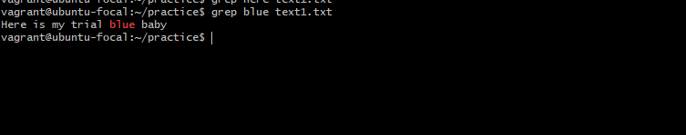
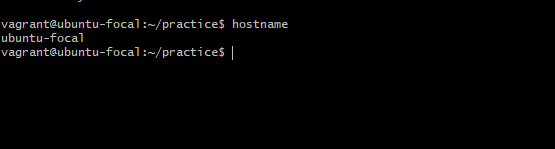
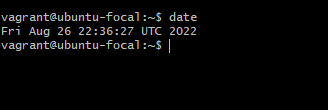

### 10 Linux Commands and their Descriptions 
 

1. Find: This command helps you search for files and directories. With the file command, you can locate fles within a directory. 
 
Example: 
 

2. Grep: This is a basic linux command that can come in handy in eveyday use. Grep allows you to search through the text in a file. 
 
Example: Here, I searched through my text.txt file for the word 'blue'. 

 

3. df: With the df command, you get information on your system's disk space usage. Adding -m at the end ( df -m) gives you the report in megabytes instead of KBs.
 
Example: 
 

4. diff: This command is a short term for 'difference'. It's used to analyze and compare the content between two files. In the example below, using the diff command shows me the content of text1 vs text2.
 
Example: 
 

5. hostname: As the name suggests, the hostname command tells you the name of your host/network.
 
Example: 
 

6. hostname -i: This command is similar to the one above. However, adding i to the hostname command shows you your ip address as we'll see below.
 
Example: 
 

7. ping: With ping, you can check the status of your connectivity to a server. Below, I used this command to check my connectivity to google.com. As you notice, it also measures the response time.
 
Example: 
 

8. cal: You can probably guess by the name that the cal command shows you the month's calendar. Let's see an example. 
 
Example: 
 

9. date: The date command, as the name suggests, shows you the current date and time.
 
Example: 
 

10. history: If i wanted to know all the previous commands I used, I would use history. The history command is useful for reviweing all your previous commands as we'll see below.
 

 

 