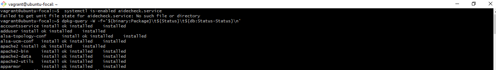
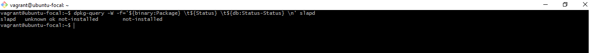
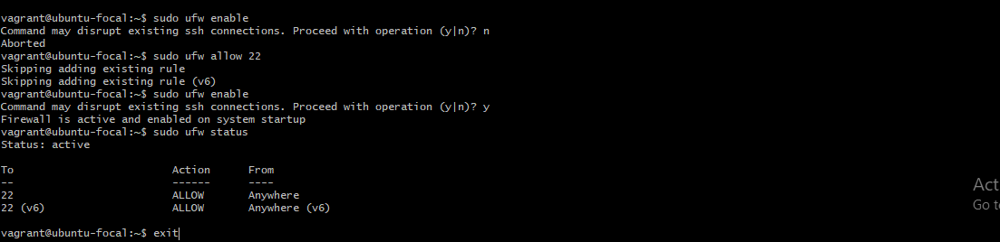
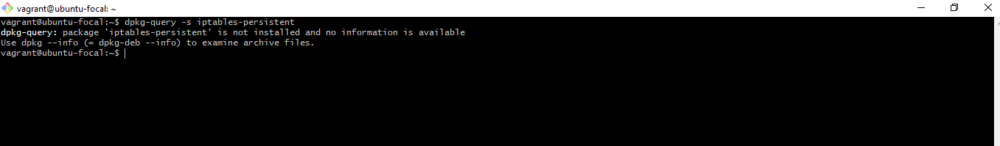

# CIS Benchmark

### 1. Disabling Automounting 
"autofs" allows automatic mounting of devices, typically including CD|DVDS and USB drives. With automounting enabled, anyone with physical access could attach a USB drive or disc and have its contents available in system even if they lacked the permission to mount it themselves.

Audit: I ran the following command to verify 'autofs' is not installed

 

### 2. Ensuring AppArmor is installed
AppArmor provides mandatory Access Controls. Without a mandatory access control system installed, only the default Discretionary Access Control system will be available.

Audit: I verified that AppArmor is intalled

 

### 3. Ensure LDAP Server is not installed
The lightweight Directory Access Protocol (LDAP) was introduced as a replacement for NIS/YP. It's a service that provides a method for looking up information from a control database. If the system will not act as an LDAP server, it's recommended that the software be removed to reduce potential attack surface.

Audit: I ran the following command to ensure 'slapd' is not installed 

 

### 4. Ensure ufw is enabled
Uncomplicated Firewall (ufw) is a frontend to iptables. It provides a framework for managing netfilters, as well as a commandline and available graphcal userinterface for managing the firewall.

Audit: I ran the following to enable ufw

 

### 5. Ensuring iptables-persistent is not installed with ufw
The iptables-persistent is a boot-time loader for netfilter rules, iptables plugins. Running both ufw and the services included in the iptables-peristent package may lead to conflict.

Audit: Ran the follwing to ensure it's not installed

